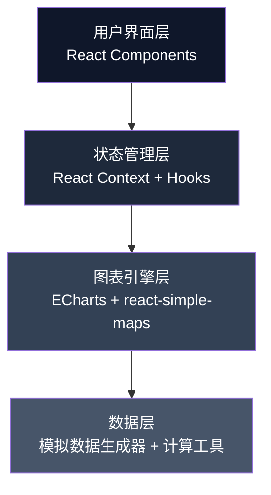
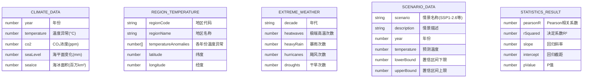

## 1. 架构设计

本项目为纯前端数据可视化应用，采用React组件化架构，集成专业图表库和地图可视化引擎，所有数据采用模拟真实科学数据的方式生成，无需后端服务。



**架构分层说明**：
- **用户界面层**：页面组件、UI控件、导航系统，负责用户交互与展示
- **状态管理层**：全局状态（当前视图、选中指标、时间范围等）、组件间通信
- **图表引擎层**：ECharts负责折线图、柱状图、散点图等统计图表；react-simple-maps负责全球地图可视化
- **数据层**：模拟科学数据生成器（基于真实气候趋势建模）、统计计算工具（相关系数、回归分析等）

## 2. 技术描述

### 2.1 核心技术栈

| 类别 | 技术选型 | 版本 | 用途说明 |
|------|----------|------|----------|
| 前端框架 | React | 18.x | 组件化UI开发 |
| 构建工具 | Vite | 5.x | 快速构建与开发服务器 |
| 编程语言 | TypeScript | 5.x | 类型安全的JavaScript |
| 样式方案 | TailwindCSS | 3.x | 原子化CSS框架 |
| 图表库 | ECharts | 5.x | 专业数据可视化图表 |
| 地图库 | react-simple-maps | 3.x | 交互式地图可视化 |
| 数据计算 | simple-statistics | 7.x | 统计分析计算（相关系数、回归等） |
| 图表导出 | html2canvas | 1.x | 图表转图片导出 |
| 图标库 | lucide-react | 0.x | 现代化SVG图标 |
| 动画库 | framer-motion | 11.x | 流畅的UI动画效果 |

### 2.2 项目初始化方式

使用 Vite 官方模板初始化 React + TypeScript 项目：
```bash
npm create vite@latest climate-viz -- --template react-ts
```

### 2.3 数据方案

**数据来源**：所有数据通过模拟生成器生成，基于真实气候科学趋势建模：
- 温度数据：基于NASA GISS温度异常数据集趋势
- CO₂数据：基于NOAA莫纳罗亚观测站数据趋势
- 海平面数据：基于AVISO卫星测高数据趋势
- 海冰数据：基于NSIDC海冰面积数据趋势
- 预测数据：基于IPCC AR6报告情景数据趋势

**数据文件结构**：
- `src/data/mockData/` - 模拟数据生成器
- `src/data/types.ts` - TypeScript数据类型定义
- `src/data/statistics.ts` - 统计计算工具函数

## 3. 路由定义

使用 React Router 6 管理单页应用路由：

| 路由路径 | 页面组件 | 功能说明 |
|---------|----------|----------|
| `/` | Dashboard | 总览仪表板，关键指标概览 |
| `/trends` | TrendsView | 趋势分析视图，多指标折线图 |
| `/map` | MapView | 全球升温分布地图 |
| `/correlation` | CorrelationView | 相关性分析面板 |
| `/extreme-weather` | ExtremeWeatherView | 极端天气事件对比 |
| `/scenarios` | ScenariosView | IPCC情景预测模拟 |
| `/export` | ExportCenter | 数据导出中心 |

## 4. 数据模型

### 4.1 核心数据类型



### 4.2 数据类型定义 (TypeScript)

```typescript
// 气候数据点
export interface ClimateDataPoint {
  year: number;
  temperature: number;
  co2: number;
  seaLevel: number;
  seaIce: number;
}

// 区域温度数据
export interface RegionTemperature {
  regionCode: string;
  regionName: string;
  temperatureAnomalies: Record<number, number>;
  latitude: number;
  longitude: number;
}

// 极端天气数据
export interface ExtremeWeatherDecade {
  decade: string;
  startYear: number;
  endYear: number;
  heatwaves: number;
  heavyRain: number;
  hurricanes: number;
  droughts: number;
}

// IPCC情景预测数据
export interface ScenarioPrediction {
  scenario: string;
  scenarioCode: string;
  description: string;
  color: string;
  data: Array<{
    year: number;
    temperature: number;
    lowerBound: number;
    upperBound: number;
  }>;
}

// 统计分析结果
export interface CorrelationResult {
  pearsonR: number;
  rSquared: number;
  slope: number;
  intercept: number;
  pValue: number;
  regressionEquation: string;
}

// 导出配置
export interface ExportConfig {
  format: 'png' | 'svg' | 'csv';
  resolution: 'low' | 'medium' | 'high';
  includeTitle: boolean;
  includeLegend: boolean;
}

// 应用状态
export interface AppState {
  currentView: string;
  selectedMetrics: string[];
  timeGranularity: 'yearly' | 'decadal';
  timeRange: [number, number];
  showBaseline: boolean;
  selectedScenario: string[];
}
```

## 5. 组件结构设计

```
src/
├── components/
│   ├── layout/
│   │   ├── Header.tsx          # 顶部导航栏
│   │   ├── Sidebar.tsx         # 侧边栏导航
│   │   └── Layout.tsx          # 主布局容器
│   ├── charts/
│   │   ├── TrendLineChart.tsx  # 趋势折线图组件
│   │   ├── ScatterChart.tsx    # 散点图组件
│   │   ├── BarChart.tsx        # 柱状图组件
│   │   └── AreaRangeChart.tsx  # 区间面积图组件
│   ├── map/
│   │   ├── WorldMap.tsx        # 世界地图组件
│   │   ├── TimeSlider.tsx      # 时间轴滑块
│   │   └── RegionInfo.tsx      # 区域信息面板
│   ├── ui/
│   │   ├── MetricCard.tsx      # 指标卡片
│   │   ├── StatCard.tsx        # 统计卡片
│   │   ├── ToggleButton.tsx    # 切换按钮
│   │   ├── NavCard.tsx         # 导航卡片
│   │   └── ExportButton.tsx    # 导出按钮
│   └── panels/
│       ├── ControlPanel.tsx    # 控制面板
│       └── StatisticsPanel.tsx # 统计信息面板
├── views/
│   ├── Dashboard.tsx           # 总览仪表板
│   ├── TrendsView.tsx          # 趋势分析视图
│   ├── MapView.tsx             # 地图视图
│   ├── CorrelationView.tsx     # 相关性分析视图
│   ├── ExtremeWeatherView.tsx  # 极端天气视图
│   ├── ScenariosView.tsx       # 情景预测视图
│   └── ExportCenter.tsx        # 导出中心
├── context/
│   └── AppContext.tsx          # 全局状态管理
├── hooks/
│   ├── useClimateData.ts       # 气候数据Hook
│   ├── useStatistics.ts        # 统计计算Hook
│   └── useExport.ts            # 导出功能Hook
├── data/
│   ├── types.ts                # 类型定义
│   ├── mockData/
│   │   ├── climateGenerator.ts # 气候数据生成器
│   │   ├── mapData.ts          # 地图数据
│   │   ├── regionTemps.ts      # 区域温度数据
│   │   ├── extremeWeather.ts   # 极端天气数据
│   │   └── scenarios.ts        # 情景预测数据
│   └── statistics.ts           # 统计计算函数
└── utils/
    ├── chartConfig.ts          # 图表配置
    ├── colors.ts               # 颜色配置
    └── formatters.ts           # 格式化工具函数
```

## 6. 性能优化策略

1. **代码分割**：按路由进行代码分割，延迟加载非首屏组件
2. **图表优化**：使用ECharts的渐进式渲染，大数据量采用数据抽样
3. **状态优化**：使用React.memo避免不必要的重渲染
4. **数据缓存**：计算结果缓存，避免重复计算统计指标
5. **资源优化**：地图TopoJSON数据压缩，按需加载区域数据

## 7. 浏览器兼容性

- 现代浏览器支持（Chrome 90+、Firefox 88+、Safari 14+、Edge 90+）
- WebGL支持（用于地图和高性能图表渲染）
- 响应式布局适配各种屏幕尺寸
