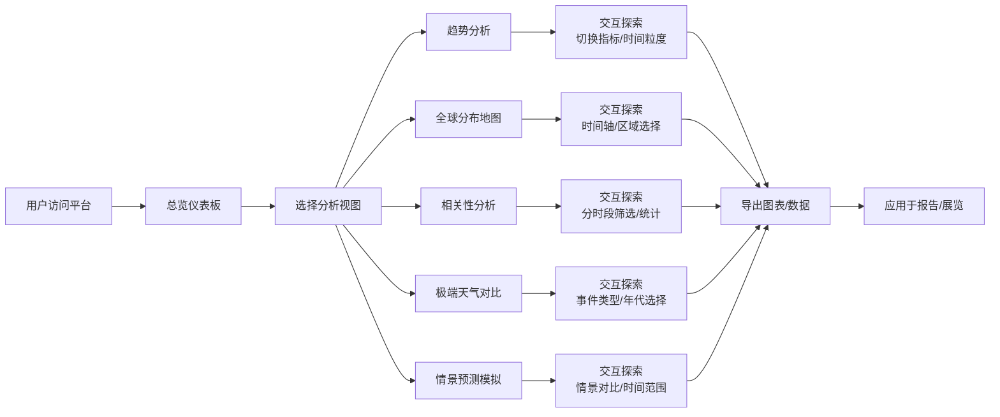

## 1. 产品概述

气候变化历史数据可视化工具，面向科普展览和研究教学场景，聚合全球地面温度、海平面高度、海冰面积、大气CO₂浓度等多源长序列数据，通过直观的图表和地图展示气候变化趋势与空间分布，支持数据分析与导出。

- **核心价值**：将复杂的气候科学数据转化为易于理解的可视化内容，提升公众气候科学素养，辅助教学研究
- **目标用户**：科普场馆参观者、教育工作者、学生、气候研究人员
- **应用场景**：科普展览互动展示、课堂教学演示、研究数据分析

## 2. 核心功能

### 2.1 用户角色

| 角色 | 注册方式 | 核心权限 |
|------|----------|----------|
| 普通用户 | 无需注册 | 浏览所有可视化图表、切换数据视图、导出图表图片 |
| 研究人员 | 无需注册 | 高级数据筛选、多指标对比分析、原始数据导出 |

### 2.2 功能模块

1. **总览仪表板**：关键气候指标概览卡片、实时数据摘要
2. **趋势分析视图**：多指标长序列趋势折线图、年/十年均值切换、基线高亮标注
3. **全球分布地图**：全球各地区升温幅度空间分布、颜色映射变化程度
4. **相关性分析面板**：CO₂浓度与温度异常的散点图、相关系数计算、统计分析
5. **极端天气对比**：不同年代极端天气事件发生次数趋势对比
6. **情景预测模拟**：IPCC排放情景数据加载、不同减排路径未来温升预测区间对比
7. **数据导出中心**：所有图表支持PNG/SVG导出、原始数据CSV导出

### 2.3 页面详情

| 页面名称 | 模块名称 | 功能描述 |
|---------|----------|----------|
| 总览仪表板 | 指标概览卡片 | 显示当前温度异常、CO₂浓度、海平面变化、海冰面积等关键指标 |
| 总览仪表板 | 快速导航 | 一键跳转到各详细分析视图 |
| 趋势分析视图 | 多指标折线图 | 温度、海平面、海冰、CO₂浓度趋势对比，支持单指标/多指标叠加 |
| 趋势分析视图 | 时间粒度切换 | 年均值/十年均值切换，工业化前基线高亮标注 |
| 全球分布地图 | 热力地图 | 全球各国/地区升温幅度空间分布，交互式悬浮查看详情 |
| 全球分布地图 | 时间轴控制 | 滑动时间轴查看不同时期的温度分布变化 |
| 相关性分析面板 | 散点图 | CO₂浓度与温度异常散点分布，支持分时段筛选 |
| 相关性分析面板 | 统计指标 | Pearson相关系数、决定系数R²、回归方程显示 |
| 极端天气对比 | 柱状图/折线图 | 不同年代极端高温、暴雨、飓风等事件频率对比 |
| 情景预测模拟 | 预测区间图 | SSP1-2.6、SSP2-4.5、SSP5-8.5等情景温升预测对比 |
| 数据导出中心 | 导出控制面板 | 选择图表类型、格式、分辨率，一键下载 |

## 3. 核心流程

用户进入平台后，首先浏览总览仪表板了解关键气候指标概览，根据兴趣或研究需求导航至各详细分析视图，通过交互式操作探索数据，最后导出需要的图表或数据用于报告或展览展示。

## 4. 用户界面设计

### 4.1 设计风格

**设计理念**：科学严谨与视觉震撼的平衡，采用深邃的地球主题配色，突出数据的可信度和气候变化的紧迫性。

- **主色调**：深海蓝 (#0F172A) - 代表地球与海洋，营造专业科技感
- **强调色**：珊瑚橙 (#F97316) - 用于温度升高警示、关键数据高亮
- **辅助色**：冰川蓝 (#38BDF8)、森林绿 (#10B981)、警示红 (#EF4444)
- **背景风格**：深空渐变背景，微妙的网格纹理，营造数据可视化的科技氛围
- **字体**：
  - 标题：**Space Grotesk** - 现代几何无衬线字体，具有科技感
  - 正文：**Inter** - 清晰易读的专业字体
  - 数据展示：**JetBrains Mono** - 等宽字体确保数字对齐美观
- **卡片样式**：半透明玻璃态效果 (Glassmorphism)，微妙边框，柔和阴影
- **交互动效**：平滑过渡动画、数据加载渐进式显示、图表悬停高亮效果

### 4.2 页面设计概述

| 页面名称 | 模块名称 | UI元素 |
|---------|----------|--------|
| 总览仪表板 | 指标概览卡片 | 4张大型数据卡片，大字号数字显示，趋势箭头指示，背景微渐变 |
| 总览仪表板 | 视图导航 | 图标+文字的卡片式导航，悬浮动效，点击反馈 |
| 趋势分析视图 | 折线图区域 | 大面积图表区域，左侧图例，顶部切换控制，悬浮显示数据详情 |
| 趋势分析视图 | 控制面板 | 指标多选按钮组、时间粒度切换开关、基线显示控制 |
| 全球分布地图 | 地图区域 | 交互式世界地图，渐变色阶图例，右下角时间轴滑块 |
| 全球分布地图 | 信息面板 | 点击区域显示详细数据卡片，包含历史趋势迷你图 |
| 相关性分析面板 | 散点图区域 | 带回归线的散点图，分色区分时段，右侧统计指标面板 |
| 相关性分析面板 | 统计卡片 | 大号字体显示相关系数、R²值，配有指标说明 |
| 极端天气对比 | 对比图表 | 分组柱状图，不同颜色区分事件类型，支持图例交互 |
| 情景预测模拟 | 预测图表 | 多条预测曲线，带置信区间填充，底部情景说明 |
| 数据导出中心 | 导出面板 | 格式选择器、分辨率滑块、预览窗口、下载按钮 |

### 4.3 响应式设计

- **桌面优先**：1920px最优设计，适配展览大屏展示（支持2K/4K分辨率）
- **平板适配**：1024px断点，侧边栏转为顶部标签栏，图表自适应缩放
- **移动适配**：768px断点，卡片单列布局，简化交互控件
- **触摸优化**：所有交互元素最小44px触控区域，支持双指缩放地图

### 4.4 动效设计

- **页面加载**：图表区域渐入动画，数据数值滚动计数效果
- **图表交互**：折线点悬浮放大、柱状图高亮、地图区域悬浮发光
- **数据切换**：平滑过渡动画，图表数据渐变更新
- **滚动效果**：滚动触发的元素渐入，视差背景效果
- **导出反馈**：导出时的加载动画，完成后的成功提示
